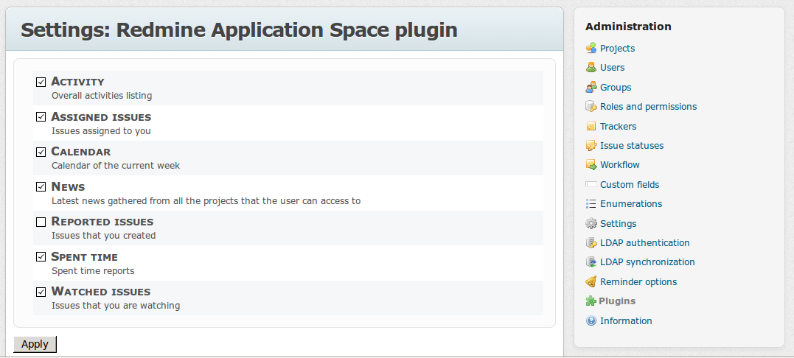
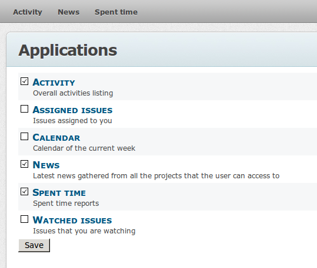

# Redmine Application Space

Tested with redmine 2.3.2, compatible with 2.x

Enhance Redmine application menu (the one that is displayed when browsing outside of projects) with dynamic configurability options.
* Administrators can select the set of applications available
* Users can select the applications they will see listed in the application menu

Both full controllers and partials (e.g. the my/blocks views) can be made an application.

## Installation

Follow standard Redmine procedure, including database migrations

## Usage

As an administrator, enter the plugin configuration page and flag the applications you want to let the users use.



As an user, you can find a new 'Applications' entry in the top-left menu, which allows to select applications wanted into the application menu.



Plugins that add entries into the application menu in the standard Redmine way keep a fixed, non configurable entry.

## How to create a new managed app

* name your plugin 'redmine_app_&lt;appname&gt;'. 
  
  Note that this plugin is named with a double underscore between 'app' and 'space', so your plugin will be always loaded after this, which is mandatory.
* this plugin creates two new routing verbs, '_application_' for apps with a controller, and '_block_' for simple partials to display as apps.
  
  These verbs create routes from 'apps/&lt;name&gt;' that must be loaded _before_ this plugin load 'apps/:tab' in order not to be ignored.
  
  Therefore, you must declare your app routing within init.rb into a section like the following examples:

  ```ruby
     RedmineApp::Application.routes.prepend do
        application 'name_of_app', :to => 'controller#method', :via => get
        block 'name_of_app', 'partial_path'
     end
  ```
  
  The syntax is similar to that of the 'match' verb, with some simplifications. Blocks restrict to the get method as default if :via is not specified.

  An additional option _:if_ is added in order to add further filters to application visibility, for example, when the admin can enable the app but some further user permission is needed. The option needs a callback with one parameter (the user).
  Example:

  ```ruby
    application 'name_of_app', :to => 'controller#method', :via => get, :if => lambda { |user| ..... }
  ```

* create translations:
  * label_&lt;name_of_app&gt; is the applications menu entry
  * label_&lt;name_of_app&gt;_description is the help text displayed in the app selection pages

